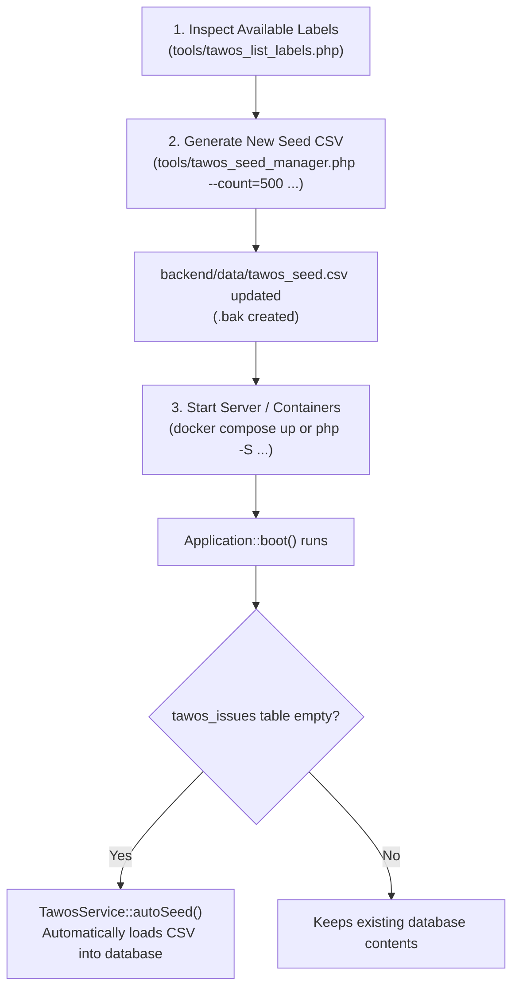
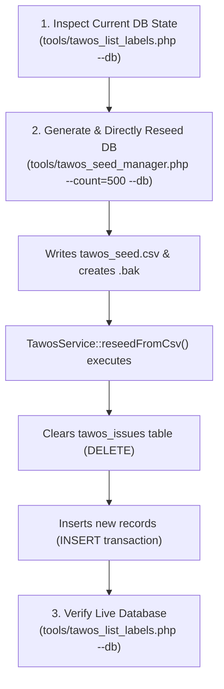
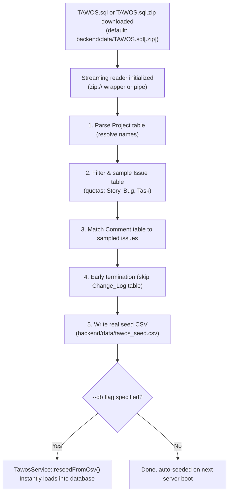

# TAWOS Data Management & Operations Guide (TAIPO)

This document provides a comprehensive guide to the **TAWOS (Tawosi Agile Web-hosted Open-Source Issues)** dataset in TAIPO, explaining the role of labels/categories, how the helper CLI tools work, and the exact **operational sequence** both before and after starting the server.

---

## Table of Contents

1. [The Role of TAWOS in TAIPO](#1-the-role-of-tawos-in-taipo)
2. [Labels and Dimensions in TAWOS](#2-labels-and-dimensions-in-tawos)
3. [Tooling Overview](#3-tooling-overview)
   - [tawos_list_labels.php](#tawos_list_labelsphp)
   - [tawos_seed_manager.php](#tawos_seed_managerphp)
   - [tawos_sql_sampler.php (Real SQL Dump Sampler)](#tawos_sql_samplerphp-real-sql-dump-sampler)
   - [setup.php and setup.sh](#setupphp-and-setupsh)
4. [Execution Workflows & Sequence](#4-execution-workflows--sequence)
   - [Scenario A: Preparation BEFORE Server Startup (Offline / Pre-boot)](#scenario-a-preparation-before-server-startup-offline--pre-boot)
   - [Scenario B: Reseeding with RUNNING Server/Database (Live Reseeding)](#scenario-b-reseeding-with-running-serverdatabase-live-reseeding)
   - [Scenario C: Sampling Real Dataset from Raw TAWOS SQL Dump (Zero-Decompression Streaming)](#scenario-c-sampling-real-dataset-from-raw-tawos-sql-dump-zero-decompression-streaming)
5. [Quota Exceeds Warning & Decision Logic (Y/N)](#5-quota-exceeds-warning--decision-logic-yn)
6. [Local Database & Offline-First Architecture](#6-local-database--offline-first-architecture)
7. [Command Reference & Examples](#7-command-reference--examples)

---

## 1. The Role of TAWOS in TAIPO

TAIPO's AI-driven Product Owner (PO) simulation relies on real-world agile engineering patterns:

- **Tone Calibration:** `Prompts::getPoCheckInPrompt()` incorporates real-world developer comments from TAWOS (`TawosService::getRandomComment()`) to calibrate the Gemini PO assistant to a concise, industrial Jira/GitHub tone.
- **Change Request Patterns:** `Prompts::getChangeRequestPrompt()` references real agile stories and bug templates to formulate realistic sprint change requests.
- **Built-in Seed Files:**
  - `backend/data/tawos_seed.csv` (80 records - compact default, auto-loaded on first boot)
  - `backend/data/tawos_seed_350.csv` (350 records - built-in expanded curated dataset containing 249 stories, 74 bugs, and 27 tasks across 14 projects, immediately available without the 4GB SQL dump)
- **Database Table:** `tawos_issues` (or prefixed, e.g., `taipo_tawos_issues`)

---

## 2. Labels and Dimensions in TAWOS

In the TAWOS dataset, labels and categories are structured across 5 primary dimensions:

| Dimension            | Field Name     | Description & Values                                                                                                                                                                 |
| :------------------- | :------------- | :----------------------------------------------------------------------------------------------------------------------------------------------------------------------------------- |
| **Issue Type**       | `type`         | Issue category: `Story` (feature request/user story), `Bug` (defect), `Task` (technical task). *(Full 500k+ dataset also includes: Improvement, New Feature, Sub-task, Epic, Wish).* |
| **Priority**         | `priority`     | Urgency tier: `Critical`, `Major`, `Minor`. *(Full dataset also includes: Blocker, Critical, Major, Minor, Trivial).*                                                                |
| **Status**           | `status`       | Workflow state: `Closed`, `Open`, `In Progress`.                                                                                                                                     |
| **Resolution**       | `resolution`   | Outcome: `Done`, `Fixed`, `Unresolved`.                                                                                                                                              |
| **Project / Module** | `project_name` | Originating project/subsystem: e.g., `AuthService`, `APIGateway`, `WebPortal`, `DevOps`, `DataPlatform`, `SecurityOps`, etc.                                                         |

---

## 3. Tooling Overview

### `tawos_list_labels.php`

Inspects and visualizes dataset labels, distributions, and percentages via formatted ANSI tables or structured JSON.

- **Sources:** Reads directly from CSV files or from the active database (`--db`).
- **Path:** `tools/tawos_list_labels.php`

### `tawos_seed_manager.php`

Configures, generates, and seeds TAWOS records into CSV and/or the database:

- **Configurable count:** Generate any volume (e.g. 80, 350, 500, 1000).
- **Real SQL Sampling (`--sql`):** Extracts real records directly from the raw TAWOS MySQL dump (`TAWOS.sql` or `.zip`) instead of multiplying synthetic templates.
- **Label focus / quotas:** Set specific counts or percentage ratios per issue type and priority.
- **Automatic backup:** Creates a `.bak` copy of the previous seed before overwriting.
- **Database synchronization:** Directly empties and repopulates the `tawos_issues` table.
- **Path:** `tools/tawos_seed_manager.php`

### `tawos_sql_sampler.php` (Real SQL Dump Sampler)

Dedicated, streaming sampler engine designed to process the official ~4GB raw `TAWOS.sql` (or `TAWOS.sql.zip`) MySQL dump:

- **Zero-Decompression Streaming:** Streams directly from compressed `.zip` files into memory via PHP `zip://` stream wrappers or `unzip -p` pipes with **zero extra disk space overhead**.
- **Default Source Path:** `backend/data/TAWOS.sql` (automatically checks for `.zip` if not specified).
- **Early Termination ($O(N)$ scanning):** Scans the `Project`, `Issue`, and `Comment` tables; once target quotas and matching comments are reached, skips the remaining multi-gigabyte tables (e.g., `Change_Log`), completing in seconds.
- **Authentic Agile Data:** Real Jira keys (`MESOS-1234`, `SPARK-5678`), authentic issue descriptions, types, priorities, actual story points, developer comments, and project names.
- **Path:** `tools/tawos_sql_sampler.php`

### `setup.php` and `setup.sh`

Comprehensive, interactive system & TAWOS configuration wizard:

- **Built-in Datasets & Sampling:** Select between the built-in 80 and 350 record datasets (`tawos_seed.csv` / `tawos_seed_350.csv`), or extract custom samples from the raw `TAWOS.sql` / `.zip` dump.
- **Direct database synchronization:** Immediately seeds the selected dataset into the local `tawos_issues` table (`--db`).
- **Path:** `tools/setup.php` and `./setup.sh` in the project root.

---

## 4. Execution Workflows & Sequence

### Scenario A: Preparation BEFORE Server Startup (Offline / Pre-boot)

> **When to use:** When you want to prepare or adjust the seed dataset (e.g., expanding from 80 to 500 items, focusing on Bugs) before starting Docker containers or the backend server.



#### Step-by-Step Instructions: A

1. **Inspect existing labels and proportions:**

   ```bash
   php tools/tawos_list_labels.php
   ```

2. **Generate the desired record count and label distribution:**
   *(Run without `--db` so only the seed CSV file is generated)*

   ```bash
   # Example: Generate 500 records (250 Stories, 200 Bugs, 50 Tasks)
   php tools/tawos_seed_manager.php --count=500 --types="Story:250,Bug:200,Task:50"
   ```

3. **Verify the generated CSV file:**

   ```bash
   php tools/tawos_list_labels.php --dimension=type
   ```

4. **Start the backend server / containers:**

   ```bash
   # If using Docker:
   docker compose up -d

   # Or if using native PHP built-in server:
   cd backend && php -S 0.0.0.0:8000 router.php
   ```

5. **How auto-seeding works:**
   When the server receives its first request, `TawosService::autoSeed()` executes:
   - If `tawos_issues` is empty, it **automatically loads** the newly generated `backend/data/tawos_seed.csv`.
   - The application boots up with your customized 500-issue dataset.

---

### Scenario B: Reseeding with RUNNING Server/Database (Live Reseeding)

> **When to use:** When the server and database are already up and running, and you want to reload or adjust the dataset without restarting containers or recreating the database.



#### Step-by-Step Instructions: B

1. **Check live database state:**

   ```bash
   php tools/tawos_list_labels.php --db
   ```

2. **Generate and directly reseed using the `--db` flag:**

   ```bash
   php tools/tawos_seed_manager.php --count=500 --types="Story:300,Bug:150,Task:50" --db
   ```

   *(In interactive mode, the script prompts: `Szeretnéd azonnal betölteni az új rekordokat a TAIPO adatbázisba? (Y/n)`, which you can confirm with `Y`).*

3. **Verify updated state in the database:**

   ```bash
   php tools/tawos_list_labels.php --db --dimension=type
   ```

---

### Scenario C: Sampling Real Dataset from Raw TAWOS SQL Dump (Zero-Decompression Streaming)

> **When to use:** When you do not want to multiply the 80 default template records, but instead want to extract authentic, diverse agile tasks (Stories, Bugs, Tasks), comments, and projects from the official ~4GB raw `TAWOS.sql` or `TAWOS.sql.zip` MySQL dump without needing to decompress 4GB onto your hard disk.



#### Step-by-Step Instructions: C

1. **Place the raw dataset:**
   Download the TAWOS dataset (e.g. UCL / Figshare DOI: 10.5522/04/21308124) into the `backend/data/` folder:
   - `backend/data/TAWOS.sql` (if uncompressed)
   - or `backend/data/TAWOS.sql.zip` (compressed zip, 0 extra disk space required!)

2. **Run the sampling process (e.g. sample 350 authentic records):**
   Directly with the sampler tool:

   ```bash
   php tools/tawos_sql_sampler.php --count=350 --db
   ```

   Or via the setup wizard:

   ```bash
   php tools/setup.php --count=350 --sql=backend/data/TAWOS.sql --db -y
   ```

   Or via the seed manager:

   ```bash
   php tools/tawos_seed_manager.php --count=350 --sql=backend/data/TAWOS.sql --db
   ```

3. **Verify the imported data:**

   ```bash
   php tools/tawos_list_labels.php --db
   ```

---

## 5. Quota Exceeds Warning & Decision Logic (Y/N)

If the sum of specified label quotas exceeds the configured target count, the tool's safeguard is triggered.

### Example

- Configured target count: **500 items**
- Specified quotas: `--types="Story:300,Bug:250"` (Sum: **550 items**)

### Console Output

```text
───────────────────────────────────────────────────────────────────
⚠️  FIGYELMEZTETÉS: A megadott címkekvóták összege túllépi a beállított értéket!
   • Beállított kívánt összérték: 500 db
   • Címkék (kvóták) összege:     550 db (Story: 300, Bug: 250)
   • Különbözet (túllépés):        +50 db
───────────────────────────────────────────────────────────────────

Túllépi a beállított értéket (500). Mindenképpen a magasabb értékkel (550) seed-eljek? (Y/n): 
```

### Possible Actions

1. **`Y` (Yes) response:**
   - Adopts the higher value ($550$ items).
   - Generates and writes 300 Stories and 250 Bugs.

2. **`N` (No) response:**
   The tool offers proportional scaling:

   ```text
   Mit szeretnél tenni?
   Arányosan skálázzam vissza a megadott címkéket az eredeti korlátra (500 db)? (Y/n): 
   ```

   - **If `Y`:** Preserves relative proportions ($54.5\%$ Story, $45.5\%$ Bug) and scales down to exactly 500 items (273 Stories, 227 Bugs).
   - **If `N`:** Cancels execution cleanly without modifying any files.

3. **Non-interactive / CI-CD mode (`-y` or `--yes`):**
   Providing `-y` automatically confirms the higher value if a quota exceed occurs.

---

## 6. Local Database & Offline-First Architecture

TAWOS data management in TAIPO is built on a **100% local, offline-first** architecture:

### Operating Rules

1. **Local Database (`tawos_issues` Table):**
   - The system exclusively uses the local database (`tawos_issues` table) and seed CSV (`backend/data/tawos_seed.csv`).
   - Zero network overhead, zero latency, fully offline-safe.
2. **Search and Filtering:**
   - The TAWOS search feature in the Dashboard Modal and the backend `?action=search_tawos` endpoint perform full-text queries directly across the indexed records in the local database (searching key, summary, description, and project).
3. **Scalability and Sampling:**
   - Any volume of real agile records can be sampled from the official raw `TAWOS.sql` or `.zip` dump using `tools/tawos_sql_sampler.php` or `setup.sh` (e.g., 80, 350, 500, or thousands of records).
   - No external API keys or external network dependencies are needed.

---

## 7. Command Reference & Examples

### A) System & TAWOS Setup Wizard (`setup.sh` / `setup.php`)

```bash
# Launch interactive configuration wizard (choose between 80, 350, or raw SQL dump):
./setup.sh
# or:
php tools/setup.php -i

# Seed the built-in 350-item dataset (tawos_seed_350.csv) immediately into the database:
php tools/setup.php --count=350 --db -y
# or with explicit source:
php tools/setup.php --source=backend/data/tawos_seed_350.csv --count=350 --db -y

# Sample 500 records from the raw ~4GB TAWOS.sql dump and seed into the database:
php tools/setup.php --count=500 --sql=backend/data/TAWOS.sql --db -y
```

### B) Inspecting Labels (`tawos_list_labels.php`)

```bash
# Full breakdown from CSV
php tools/tawos_list_labels.php

# Full breakdown from database
php tools/tawos_list_labels.php --db

# Filter by a single dimension
php tools/tawos_list_labels.php --dimension=type
php tools/tawos_list_labels.php --dimension=priority
php tools/tawos_list_labels.php --dimension=status
php tools/tawos_list_labels.php --dimension=resolution
php tools/tawos_list_labels.php --dimension=project

# Inspect an external CSV file
php tools/tawos_list_labels.php --csv=/path/to/custom_tawos.csv

# Output as JSON
php tools/tawos_list_labels.php --json
```

### C) Local Seed Generation (`tawos_seed_manager.php`)

```bash
# 1. Generate 500 records into CSV keeping natural distribution
php tools/tawos_seed_manager.php --count=500

# 2. Generate 500 records with Bug focus and seed directly into database
php tools/tawos_seed_manager.php --count=500 --types="Story:200,Bug:250,Task:50" --db

# 3. Use percentage-based distribution
php tools/tawos_seed_manager.php --count=400 --types="Story:60%,Bug:30%,Task:10%" --db

# 4. Trigger quota exceeds warning check
php tools/tawos_seed_manager.php --count=500 --types="Story:300,Bug:250"

# 5. Launch interactive wizard
php tools/tawos_seed_manager.php -i

# 6. Automated non-interactive seeding with no backup
php tools/tawos_seed_manager.php --count=1000 -y --no-backup --db
```

### D) Real TAWOS SQL Streaming Sampling (`tawos_sql_sampler.php`)

```bash
# 1. Sample 350 authentic records from default path (backend/data/TAWOS.sql or .zip)
php tools/tawos_sql_sampler.php --count=350

# 2. Sample directly from compressed ZIP with automatic database seeding
php tools/tawos_sql_sampler.php --sql=backend/data/TAWOS.sql.zip --count=350 --db

# 3. Enforce custom type and priority quota distributions
php tools/tawos_sql_sampler.php --count=500 --types="Story:60%,Bug:30%,Task:10%" --priorities="Critical:50,Major:250,Minor:50" --db

# 4. Output to custom CSV file without backup
php tools/tawos_sql_sampler.php --sql=backend/data/TAWOS.sql --count=200 --output=backend/data/custom_sample.csv --no-backup
```
