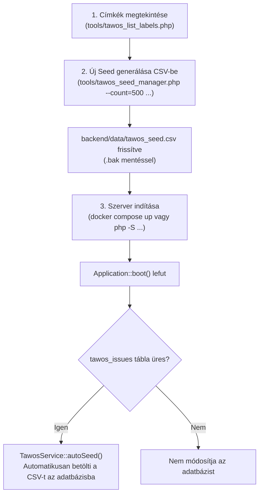
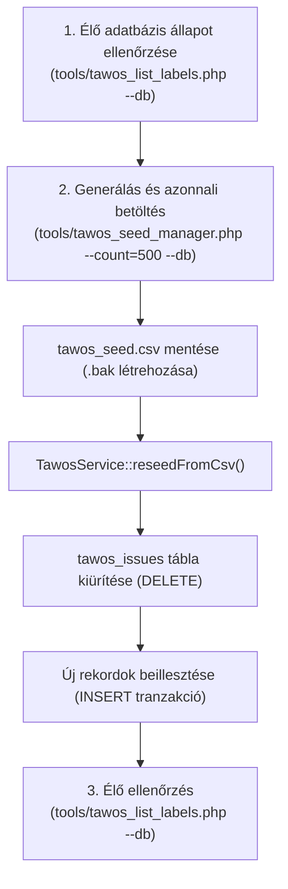

# TAWOS adatkezelési és működési útmutató (TAIPO)

Ez a dokumentum részletesen bemutatja a **TAWOS (Tawosi Agile Web-hosted Open-Source Issues)** adathalmaz szerepét a TAIPO rendszerben, a rendelkezésre álló címkéket (labels), a segédeszközök működését, valamint a pontos **végrehajtási sorrendet** a szerver indítása előtt és után.

---

## Tartalomjegyzék

1. [A TAWOS szerepe a TAIPO rendszerben](#1-a-tawos-szerepe-a-taipo-rendszerben)
2. [Címkék és dimenziók a TAWOS adatkészletben](#2-címkék-és-dimenziók-a-tawos-adatkészletben)
3. [Eszközök áttekintése](#3-eszközök-áttekintése)
   - [tawos_list_labels.php](#tawos_list_labelsphp)
   - [tawos_seed_manager.php](#tawos_seed_managerphp)
4. [Működési forgatókönyvek és sorrend](#4-működési-forgatókönyvek-és-sorrend)
   - [A) forgatókönyv: Előkészítés a szerver indítása ELŐTT (Offline / Pre-boot)](#a-forgatókönyv-előkészítés-a-szerver-indítása-előtt-offline--pre-boot)
   - [B) forgatókönyv: Frissítés futó szerver / adatbázis MELLETT (Live Reseeding)](#b-forgatókönyv-frissítés-futó-szerver--adatbázis-mellett-live-reseeding)
5. [Túllépési figyelmeztetés és döntési logika (Y/N)](#5-túllépési-figyelmeztetés-és-döntési-logika-yn)
6. [Parancsreferencia és példák](#6-parancsreferencia-és-példák)

---

## 1. A TAWOS szerepe a TAIPO rendszerben

A TAIPO mesterséges intelligencia által vezérelt Product Owner (PO) szimulációja valós ipari agilis mintákra épül:

- **Tone Calibration (Hangnem kalibrálás):** A `Prompts::getPoCheckInPrompt()` valós TAWOS kommenteket használ fel (`TawosService::getRandomComment()`), hogy a Gemini PO modell professzionális, ipari Jira/GitHub stílusban adjon visszajelzést a fejlesztőknek.
- **Change Request minták:** A `Prompts::getChangeRequestPrompt()` valós felhasználói sztorik és hiba leírások mintázatát használja fel az életszerű módosítási kérések (Change Request) generálásához.
- **Alapértelmezett seed fájl:** `backend/data/tawos_seed.csv`
- **Adatbázistábla:** `tawos_issues` (vagy táblaprefixszel, pl. `taipo_tawos_issues`)

---

## 2. Címkék és dimenziók a TAWOS adatkészletben

A TAWOS adathalmazban a címkék 5 fő dimenzióra tagolódnak:

| Dimenzió            | Mezőnév        | Leírás és lehetséges értékek                                                                                                                                                   |
| :------------------ | :------------- | :----------------------------------------------------------------------------------------------------------------------------------------------------------------------------- |
| **Issue Típus**     | `type`         | A feladat jellege: `Story` (funkció/sztori), `Bug` (hiba), `Task` (technikai feladat). *(A teljes 500k+ TAWOS-ban továbbiak: Improvement, New Feature, Sub-task, Epic, Wish).* |
| **Prioritás**       | `priority`     | Sürgősségi szint: `Critical`, `Major`, `Minor`. *(A teljes adathalmazban: Blocker, Critical, Major, Minor, Trivial).*                                                          |
| **Státusz**         | `status`       | Munkafolyamat állapot: `Closed`, `Open`, `In Progress`.                                                                                                                        |
| **Megoldás**        | `resolution`   | Lezárás eredménye: `Done`, `Fixed`, `Unresolved`.                                                                                                                              |
| **Projekt / Modul** | `project_name` | A feladat modulja / forrásprojektje: pl. `AuthService`, `APIGateway`, `WebPortal`, `DevOps`, `DataPlatform`, `SecurityOps` stb.                                                |

---

## 3. Eszközök áttekintése

### `tawos_list_labels.php`

Címkék, megoszlások és arányok lekérdezése és formázott megjelenítése terminálban vagy JSON formátumban.

- **Forrás:** Képes közvetlenül CSV fájlból vagy élő adatbázisból (`--db`) olvasni.
- **Elérési út:** `tools/tawos_list_labels.php`

### `tawos_seed_manager.php`

A seedelendő rekordok számának és címkearányainak beállítása, mintavételezése és kiírása:

- **Seed rekordszám beállítása:** tetszőleges elemszám generálása (pl. 80, 500, 1000).
- **Címkefókusz / kvóták:** arányok vagy konkrét darabszámok megadása típusonként és prioritásonként.
- **Biztonsági mentés:** a meglévő CSV-ről automatikusan `.bak` másolatot készít.
- **Adatbázis szinkronizáció:** közvetlenül képes betölteni a generált adatokat a `tawos_issues` táblába.
- **Elérési út:** `tools/tawos_seed_manager.php`

---

## 4. Működési Forgatókönyvek és Sorrend

### A) forgatókönyv: Előkészítés a szerver indítása ELŐTT (Offline / Pre-boot)

> **Mikor használandó?** Ha a konténerek vagy a backend szerver indítása előtt szeretnénk előkészíteni a kívánt méretű és címkefókuszú seed adatot.



#### Lépések: A

1. **Címkék és kiinduló eloszlás ellenőrzése:**

   ```bash
   php tools/tawos_list_labels.php
   ```

2. **Kívánt rekordszám és címkefókusz beállítása a seed fájlba:**
   *(Adatbázis kapcsoló nélkül, így csak a CSV fájl frissül)*

   ```bash
   # Példa: 500 rekord generálása (250 Story, 200 Bug, 50 Task)
   php tools/tawos_seed_manager.php --count=500 --types="Story:250,Bug:200,Task:50"
   ```

3. **Eredmény ellenőrzése a CSV-ben:**

   ```bash
   php tools/tawos_list_labels.php --dimension=type
   ```

4. **Szerver indítása:**

   ```bash
   # Docker esetén:
   docker compose up -d

   # Vagy natív PHP backend esetén:
   cd backend && php -S 0.0.0.0:8000 router.php
   ```

5. **Automatikus betöltés működése:**
   Amikor a backend elindul és az első kérés megérkezik, a `TawosService::autoSeed()` ellenőrzi, hogy a `tawos_issues` tábla tartalmaz-e adatot:
   - Ha a tábla üres, **automatikusan importálja** a frissen generált `backend/data/tawos_seed.csv` fájlt.
   - Így az adatbázis azonnal az új, 500 elemes adatkészlettel áll fel.

---

### B) forgatókönyv: Frissítés futó szerver / adatbázis MELLETT (Live Reseeding)

> **Mikor használandó?** Ha a rendszer már fut, de meg szeretnénk változtatni a seedelt adatok számát vagy címkeeloszlását.



#### Lépések: B

1. **Jelenlegi adatbázis állapot lekérése:**

   ```bash
   php tools/tawos_list_labels.php --db
   ```

2. **Generálás és azonnali adatbázisba seedelés a `--db` kapcsolóval:**

   ```bash
   php tools/tawos_seed_manager.php --count=500 --types="Story:300,Bug:150,Task:50" --db
   ```

   *(Interaktív módban a szkript a végén megkérdezi: `Szeretnéd azonnal betölteni az új rekordokat a TAIPO adatbázisba? (Y/n)`, így elég jóváhagyni).*

3. **Frissített állapot ellenőrzése az adatbázisban:**

   ```bash
   php tools/tawos_list_labels.php --db --dimension=type
   ```

---

## 5. Túllépési figyelmeztetés és döntési logika (Y/N)

Ha a megadott típus- vagy címkekvóták összege túllépi az előre beállított összértéket, a rendszer védelmi mechanizmusa aktiválódik.

### Példa

- Beállított célméret: **500 db**
- Megadott kvóták: `--types="Story:300,Bug:250"` (Összeg: **550 db**)

### Megjelenő figyelmeztetés a konzolon

```text
───────────────────────────────────────────────────────────────────
⚠️  FIGYELMEZTETÉS: A megadott címkekvóták összege túllépi a beállított értéket!
   • Beállított kívánt összérték: 500 db
   • Címkék (kvóták) összege:     550 db (Story: 300, Bug: 250)
   • Különbözet (túllépés):        +50 db
───────────────────────────────────────────────────────────────────

Túllépi a beállított értéket (500). Mindenképpen a magasabb értékkel (550) seed-eljek? (Y/n): 
```

### Lehetséges válaszok

1. **`Y` (Igen) válasz:**
   - A rendszer elfogadja a magasabb értéket ($550$ db).
   - 300 Story és 250 Bug kerül kiírásra és beillesztésre.

2. **`N` (Nem) válasz:**
   A szkript megkérdezi a visszaskálázást:

   ```text
   Mit szeretnél tenni?
   Arányosan skálázzam vissza a megadott címkéket az eredeti korlátra (500 db)? (Y/n):
   ```

   - **`Y` esetén:** Megtartja a címkék egymáshoz viszonyított arányát (54.5% Story, 45.5% Bug), és visszaskálázza pontosan 500 darabra (273 Story, 227 Bug).
   - **`N` esetén:** Megszakítja a futást módosítás nélkül (`Művelet megszakítva a felhasználó kérésére`).

3. **Nem-interaktív / CI-CD futtatás (`-y` vagy `--yes`):**
   Ha a parancssorban megadod a `-y` kapcsolót, figyelmeztetés esetén automatikusan a magasabb értéket hagyja jóvá kérdés nélkül.

---

## 6. Parancsreferencia és példák

### A) Címkék listázása (`tawos_list_labels.php`)

```bash
# Teljes statisztika a seed CSV-ből
php tools/tawos_list_labels.php

# Teljes statisztika az adatbázisból
php tools/tawos_list_labels.php --db

# Csak egy adott dimenzió lekérése
php tools/tawos_list_labels.php --dimension=type
php tools/tawos_list_labels.php --dimension=priority
php tools/tawos_list_labels.php --dimension=status
php tools/tawos_list_labels.php --dimension=resolution
php tools/tawos_list_labels.php --dimension=project

# Adott külső CSV elemzése
php tools/tawos_list_labels.php --csv=/eleresi/ut/egyedi_tawos.csv

# JSON kimenet
php tools/tawos_list_labels.php --json
```

### B) Seed beállítása és generálása (`tawos_seed_manager.php`)

```bash
# 1. 500 rekord generálása CSV-be az alapértelmezett megoszlás szerint
php tools/tawos_seed_manager.php --count=500

# 2. 500 rekord generálása, erősebb hiba (Bug) fókusszal és adatbázisba írással
php tools/tawos_seed_manager.php --count=500 --types="Story:200,Bug:250,Task:50" --db

# 3. Százalékos fókusz megadása
php tools/tawos_seed_manager.php --count=400 --types="Story:60%,Bug:30%,Task:10%" --db

# 4. Túllépés tesztelése figyelmeztetéssel
php tools/tawos_seed_manager.php --count=500 --types="Story:300,Bug:250"

# 5. Teljes interaktív varázsló indítása
php tools/tawos_seed_manager.php -i

# 6. Biztonsági mentés kihagyása és automatikus megerősítés
php tools/tawos_seed_manager.php --count=1000 -y --no-backup --db
```
